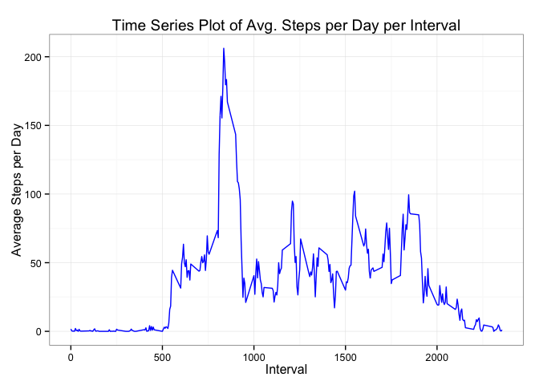
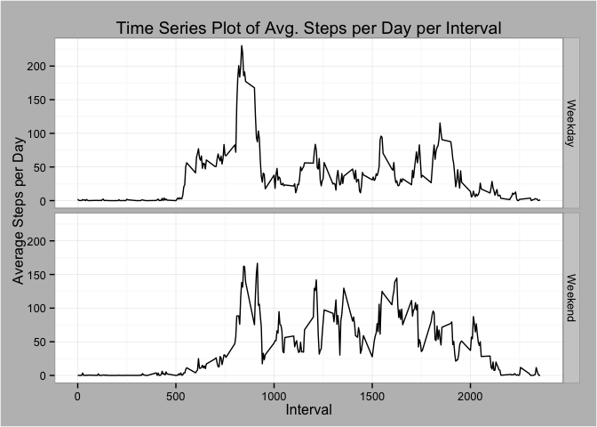

# Reproducible Research: Peer Assessment 1 Submission


## Loading and preprocessing the data

#####Assumes you have downloaded this information and unzipped the data into your working directory. 


```r
activity <- read.csv("/Users/michaelmorgan/Desktop/octproject1/activity.csv", header = TRUE, stringsAsFactors = FALSE)
```


```r
library(dplyr)
```

```
## 
## Attaching package: 'dplyr'
## 
## The following objects are masked from 'package:stats':
## 
##     filter, lag
## 
## The following objects are masked from 'package:base':
## 
##     intersect, setdiff, setequal, union
```

```r
library(ggvis)
library(ggplot2)
```

```
## 
## Attaching package: 'ggplot2'
## 
## The following object is masked from 'package:ggvis':
## 
##     resolution
```

```r
library(lubridate)
```


## What is mean total number of steps taken per day?

#####First, calculate the total number of steps


```r
totalsteps <- group_by(activity, date) %>% filter(!is.na(steps)) %>% summarize(totalsteps = sum(steps))
```

#####Next, here is a histogram of the total number of steps taken per day. 


```r
totalsteps %>% ggvis(~totalsteps) %>% layer_histograms() %>% add_axis("x", title = "Total Steps Taken in a Day") %>% add_axis("y", title = "Count of Days with That Many Steps") 
```

```
## Guessing width = 1000 # range / 22
```

<!--html_preserve--><div id="plot_id568085470-container" class="ggvis-output-container">
<div id="plot_id568085470" class="ggvis-output"></div>
<div class="plot-gear-icon">
<nav class="ggvis-control">
<a class="ggvis-dropdown-toggle" title="Controls" onclick="return false;"></a>
<ul class="ggvis-dropdown">
<li>
Renderer: 
<a id="plot_id568085470_renderer_svg" class="ggvis-renderer-button" onclick="return false;" data-plot-id="plot_id568085470" data-renderer="svg">SVG</a>
 | 
<a id="plot_id568085470_renderer_canvas" class="ggvis-renderer-button" onclick="return false;" data-plot-id="plot_id568085470" data-renderer="canvas">Canvas</a>
</li>
<li>
<a id="plot_id568085470_download" class="ggvis-download" data-plot-id="plot_id568085470">Download</a>
</li>
</ul>
</nav>
</div>
</div>
<script type="text/javascript">
var plot_id568085470_spec = {
  "data": [
    {
      "name": ".0/bin1/stack2",
      "format": {
        "type": "csv",
        "parse": {
          "xmin_": "number",
          "xmax_": "number",
          "stack_upr_": "number",
          "stack_lwr_": "number"
        }
      },
      "values": "\"xmin_\",\"xmax_\",\"stack_upr_\",\"stack_lwr_\"\n-500,500,2,0\n500,1500,0,0\n1500,2500,1,0\n2500,3500,1,0\n3500,4500,1,0\n4500,5500,2,0\n5500,6500,0,0\n6500,7500,3,0\n7500,8500,2,0\n8500,9500,3,0\n9500,10500,9,0\n10500,11500,7,0\n11500,12500,4,0\n12500,13500,7,0\n13500,14500,3,0\n14500,15500,5,0\n15500,16500,0,0\n16500,17500,1,0\n17500,18500,0,0\n18500,19500,0,0\n19500,20500,1,0\n20500,21500,1,0"
    },
    {
      "name": "scale/x",
      "format": {
        "type": "csv",
        "parse": {
          "domain": "number"
        }
      },
      "values": "\"domain\"\n-1600\n22600"
    },
    {
      "name": "scale/y",
      "format": {
        "type": "csv",
        "parse": {
          "domain": "number"
        }
      },
      "values": "\"domain\"\n0\n9.45"
    }
  ],
  "scales": [
    {
      "name": "x",
      "domain": {
        "data": "scale/x",
        "field": "data.domain"
      },
      "zero": false,
      "nice": false,
      "clamp": false,
      "range": "width"
    },
    {
      "name": "y",
      "domain": {
        "data": "scale/y",
        "field": "data.domain"
      },
      "zero": false,
      "nice": false,
      "clamp": false,
      "range": "height"
    }
  ],
  "marks": [
    {
      "type": "rect",
      "properties": {
        "update": {
          "stroke": {
            "value": "#000000"
          },
          "fill": {
            "value": "#333333"
          },
          "x": {
            "scale": "x",
            "field": "data.xmin_"
          },
          "x2": {
            "scale": "x",
            "field": "data.xmax_"
          },
          "y": {
            "scale": "y",
            "field": "data.stack_upr_"
          },
          "y2": {
            "scale": "y",
            "field": "data.stack_lwr_"
          }
        },
        "ggvis": {
          "data": {
            "value": ".0/bin1/stack2"
          }
        }
      },
      "from": {
        "data": ".0/bin1/stack2"
      }
    }
  ],
  "legends": [],
  "axes": [
    {
      "type": "x",
      "scale": "x",
      "orient": "bottom",
      "title": "Total Steps Taken in a Day",
      "layer": "back",
      "grid": true
    },
    {
      "type": "y",
      "scale": "y",
      "orient": "left",
      "title": "Count of Days with That Many Steps",
      "layer": "back",
      "grid": true
    }
  ],
  "padding": null,
  "ggvis_opts": {
    "keep_aspect": false,
    "resizable": true,
    "padding": {},
    "duration": 250,
    "renderer": "svg",
    "hover_duration": 0,
    "width": 672,
    "height": 480
  },
  "handlers": null
};
ggvis.getPlot("plot_id568085470").parseSpec(plot_id568085470_spec);
</script><!--/html_preserve-->

#####Getting the mean and the median becomes fairly easy. This is the data that had NAs in it. 


```r
mean <- mean(totalsteps$totalsteps)
median <- median(totalsteps$totalsteps)
xna <- c(mean = mean, median = median)
print(xna)
```

```
##     mean   median 
## 10766.19 10765.00
```

## What is the average daily activity pattern?

#####Below is a time series graph displaying this information. 


```r
cleaned <- filter(activity, !is.na(steps)) 
cleaned <- group_by(cleaned, interval) %>% summarize(NumSteps = mean(steps))

ggplot(cleaned, aes(interval, NumSteps)) + geom_line(color = "blue") + 
        xlab("Interval") + ylab("Average Steps per Day") + theme_bw() + 
        ggtitle("Time Series Plot of Avg. Steps per Day per Interval")
```

 


#####The following interval, on average across all days in the data set, contains the maximum number of steps. 


```r
x <- arrange(cleaned, desc(NumSteps))
print(x[1,1])
```

```
## Source: local data frame [1 x 1]
## 
##   interval
## 1      835
```

## Imputing missing values

#####The total number of missing values is calculated below 


```r
nas <- sum(is.na(activity))
print(nas)
```

```
## [1] 2304
```

#####My strategy for filling in the NA values was to pull out all the observations with NAs into its own data frame, and then to join in the cleaned data with the average steps by interval created above. Joining by interval allowed me to replace each NA data point with the average number of steps for that interval. After correcting headers in this cleaned NA data set, I appended it to the original data set, from which NAs had been removed, to create a combined data set. 


```r
activity2 <- arrange(activity, desc(steps))
extractnas <- filter(activity2, is.na(steps))
c <- left_join(extractnas, cleaned, by = "interval")
c <- select(c, NumSteps, date, interval)
activityclean <- filter(activity, !is.na(steps))
names(c)[1] <- "steps"
activityclean <- rbind(activityclean, c)
```

#####Next, I used this clean data to create a data set and histogram comparable to the first histogram. tclean is a data set I used for to calculate the actual difference between the original data; the histogram is created by the totalcleansteps code, piped all the way to the graph. 


```r
tclean <- group_by(activityclean, date) %>% summarize(totalsteps = sum(steps))
```

#####Histogram of cleaned data 


```r
totalcleansteps <- group_by(activityclean, date) %>% summarize(totalsteps = sum(steps)) %>% ggvis(~totalsteps) %>% layer_histograms() %>% add_axis("x", title = "Total Steps Taken in a Day") %>% add_axis("y", title = "Count of Days with That Many Steps") 
```

```
## Guessing width = 1000 # range / 22
```

```r
print(totalcleansteps)
```

<!--html_preserve--><div id="plot_528224665-container" class="ggvis-output-container">
<div id="plot_528224665" class="ggvis-output"></div>
<div class="plot-gear-icon">
<nav class="ggvis-control">
<a class="ggvis-dropdown-toggle" title="Controls" onclick="return false;"></a>
<ul class="ggvis-dropdown">
<li>
Renderer: 
<a id="plot_528224665_renderer_svg" class="ggvis-renderer-button" onclick="return false;" data-plot-id="plot_528224665" data-renderer="svg">SVG</a>
 | 
<a id="plot_528224665_renderer_canvas" class="ggvis-renderer-button" onclick="return false;" data-plot-id="plot_528224665" data-renderer="canvas">Canvas</a>
</li>
<li>
<a id="plot_528224665_download" class="ggvis-download" data-plot-id="plot_528224665">Download</a>
</li>
</ul>
</nav>
</div>
</div>
<script type="text/javascript">
var plot_528224665_spec = {
  "data": [
    {
      "name": ".0/bin1/stack2",
      "format": {
        "type": "csv",
        "parse": {
          "xmin_": "number",
          "xmax_": "number",
          "stack_upr_": "number",
          "stack_lwr_": "number"
        }
      },
      "values": "\"xmin_\",\"xmax_\",\"stack_upr_\",\"stack_lwr_\"\n-500,500,2,0\n500,1500,0,0\n1500,2500,1,0\n2500,3500,1,0\n3500,4500,1,0\n4500,5500,2,0\n5500,6500,0,0\n6500,7500,3,0\n7500,8500,2,0\n8500,9500,3,0\n9500,10500,9,0\n10500,11500,15,0\n11500,12500,4,0\n12500,13500,7,0\n13500,14500,3,0\n14500,15500,5,0\n15500,16500,0,0\n16500,17500,1,0\n17500,18500,0,0\n18500,19500,0,0\n19500,20500,1,0\n20500,21500,1,0"
    },
    {
      "name": "scale/x",
      "format": {
        "type": "csv",
        "parse": {
          "domain": "number"
        }
      },
      "values": "\"domain\"\n-1600\n22600"
    },
    {
      "name": "scale/y",
      "format": {
        "type": "csv",
        "parse": {
          "domain": "number"
        }
      },
      "values": "\"domain\"\n0\n15.75"
    }
  ],
  "scales": [
    {
      "name": "x",
      "domain": {
        "data": "scale/x",
        "field": "data.domain"
      },
      "zero": false,
      "nice": false,
      "clamp": false,
      "range": "width"
    },
    {
      "name": "y",
      "domain": {
        "data": "scale/y",
        "field": "data.domain"
      },
      "zero": false,
      "nice": false,
      "clamp": false,
      "range": "height"
    }
  ],
  "marks": [
    {
      "type": "rect",
      "properties": {
        "update": {
          "stroke": {
            "value": "#000000"
          },
          "fill": {
            "value": "#333333"
          },
          "x": {
            "scale": "x",
            "field": "data.xmin_"
          },
          "x2": {
            "scale": "x",
            "field": "data.xmax_"
          },
          "y": {
            "scale": "y",
            "field": "data.stack_upr_"
          },
          "y2": {
            "scale": "y",
            "field": "data.stack_lwr_"
          }
        },
        "ggvis": {
          "data": {
            "value": ".0/bin1/stack2"
          }
        }
      },
      "from": {
        "data": ".0/bin1/stack2"
      }
    }
  ],
  "legends": [],
  "axes": [
    {
      "type": "x",
      "scale": "x",
      "orient": "bottom",
      "title": "Total Steps Taken in a Day",
      "layer": "back",
      "grid": true
    },
    {
      "type": "y",
      "scale": "y",
      "orient": "left",
      "title": "Count of Days with That Many Steps",
      "layer": "back",
      "grid": true
    }
  ],
  "padding": null,
  "ggvis_opts": {
    "width": 600,
    "height": 400,
    "keep_aspect": false,
    "resizable": true,
    "padding": {},
    "duration": 250,
    "renderer": "svg",
    "hover_duration": 0
  },
  "handlers": null
};
ggvis.getPlot("plot_528224665").parseSpec(plot_528224665_spec);
</script><!--/html_preserve-->

#####Here are the mean and median number of steps, cleaned. 


```r
cleanmean <- mean(tclean$totalsteps)
cleanmedian <- median(tclean$totalsteps)
xclean <- c(mean = cleanmean, median = cleanmedian)
print(xclean)
```

```
##     mean   median 
## 10766.19 10766.19
```

#####For the actual difference between the original mean and median, and that of the cleaned data. 


```r
xna - xclean
```

```
##      mean    median 
##  0.000000 -1.188679
```

## Are there differences in activity patterns between weekdays and weekends?

#####I used lubridate (wday, label = FALSE) to deal with the weekend or weekday issue (which, honestly, is pretty amazing -- I had to check actual calendars to make sure it worked that easily). After creating the data sets with the weekend and weekday data, I calculated the averages. I then joined the interval data back in, and used rbind to combine the two data sets. Finally, I used ggplot to create the panel graph. 


```r
days <- mutate(tclean, day = (wday(date, label = FALSE)))
days <- days %>% mutate(wkndwkd = ifelse(day == 1 | day == 7, "Weekend", "Weekday"))

joined <- left_join(activityclean, days, by = "date")
weekend <- filter(joined, wkndwkd == "Weekend")
weekday <- filter(joined, wkndwkd == "Weekday")

weekday <- group_by(weekday, interval, wkndwkd) %>% summarize(AvgSteps = mean(steps))
weekend <- group_by(weekend, interval, wkndwkd) %>% summarize(AvgSteps = mean(steps))
forgraph <- rbind(weekend, weekday)

lastgraph <- ggplot(forgraph, aes(interval, AvgSteps)) + geom_line(color = "black") + 
        xlab("Interval") + ylab("Average Steps per Day") + theme_bw() + 
        ggtitle("Time Series Plot of Avg. Steps per Day per Interval") + facet_grid(wkndwkd~.) + theme(plot.background=element_rect(fill="gray"))

print(lastgraph)
```

 

#####Good luck, I am off to fly-fish near the top of the world. 

